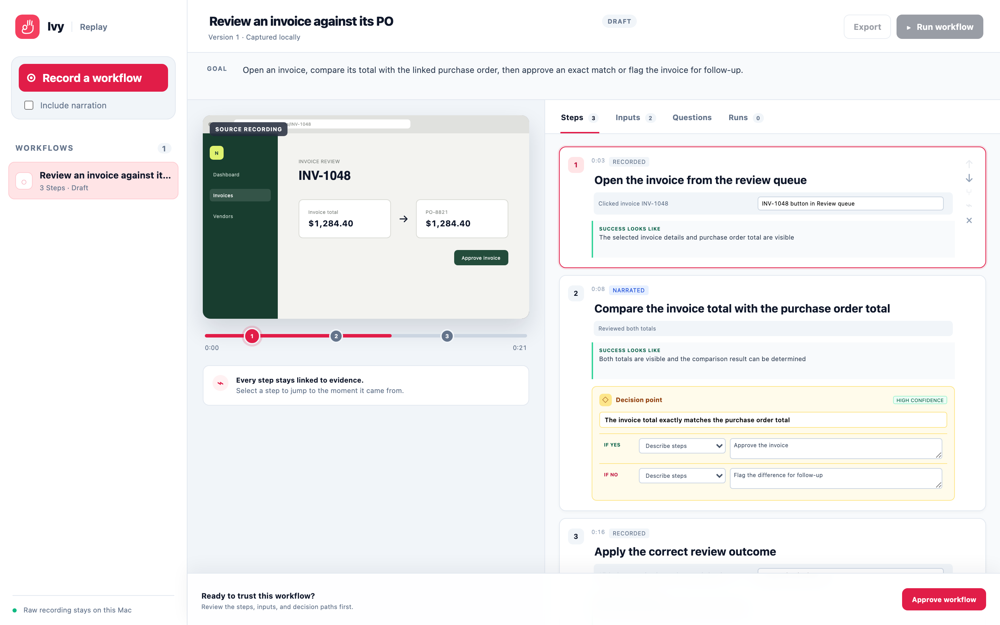
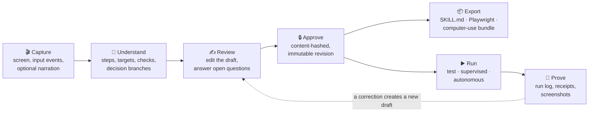
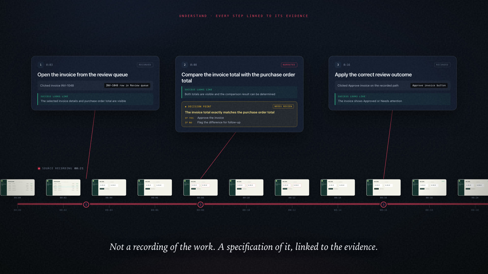
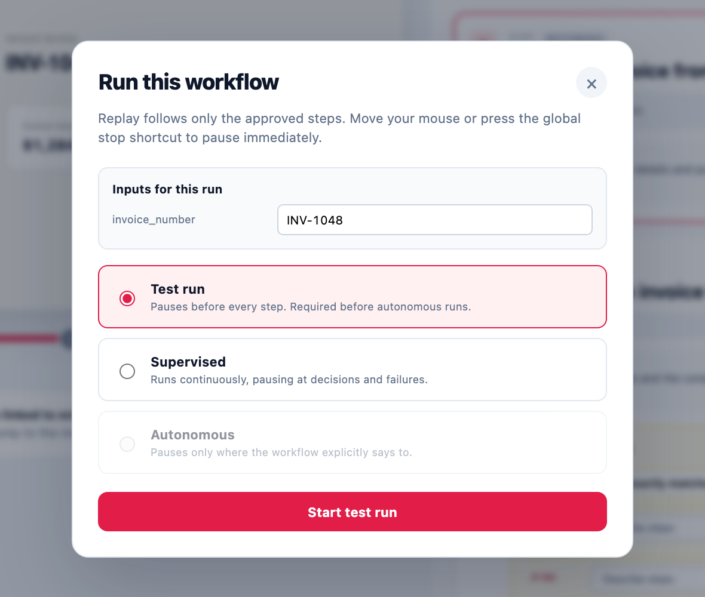

<div align="center">

# Replay

**Show the work. Teach the agent. Trust the result.**

Replay turns a demonstration of real work on your Mac into a workflow you can inspect, correct, approve, export, and run again, with every step linked back to the evidence it came from.

[](https://github.com/misb74/Replay/actions/workflows/ci.yml) [](LICENSE)    

[**Watch the film**](#-the-film) · [How it works](#how-it-works) · [Quick start](#quick-start) · [Architecture](docs/architecture.md) · [Contributing](CONTRIBUTING.md)

<a href="marketing/promo-video-v2/output/replay-film-1080p.mp4">
  
</a>

</div>

> [!WARNING]
> Replay is an early-stage macOS prototype that **can control real applications**. Use test or supervised mode, review every generated workflow, and keep the emergency stop (**⌘⇧⎋**) within reach. It is not yet a signed end-user release.

## Why Replay

The hardest part of automating real work isn't the clicks. It's the judgment between them: the rule an expert applies without thinking, which never makes it into a process document.

Replay captures that judgment. You do the task once and narrate if you like. Replay proposes a workflow in which every step points to the moment it was observed, surfaces what it's unsure about, and asks you to settle the ambiguity before anything runs. The reviewed, content-hashed revision becomes the source of truth for people, browser scripts, and computer-use agents alike.

<p align="center">
  
  <br>
  <sub>Reviewing a captured workflow. Each step jumps to the moment in the recording it came from, and decision points show where the expert's judgment lives.</sub>
</p>

## How it works



| Stage | What happens |
| --- | --- |
| **Capture** | Record a task on the primary Mac display with the native Swift sidecar, optionally with narration. |
| **Understand** | Redacted, condensed events, narration, and selected frames become steps, targets, success checks, inputs, and decision branches. |
| **Review** | Edit the draft and resolve open questions. Unresolved low-confidence questions block approval. |
| **Approve** | Stamp a content-hashed revision that can't silently change underneath a run. |
| **Reuse** | Export the approved revision, or run it on the Mac in test, supervised, or revision-trusted autonomous mode. |
| **Prove** | Keep run outcomes, decisions, action receipts, and screenshots as evidence. |

## What you get

One approved revision compiles to every target, so the playbook, the script, and the agent bundle can never drift apart.

| Output | Files | For |
| --- | --- | --- |
| **Playbook** | `SKILL.md` | A readable procedure for a person or an agent |
| **Playwright workflow** | `workflow.ts`, `compile-report.json` | Deterministic browser automation, with an explicit report of fallbacks |
| **Computer-use bundle** | `system-prompt.md`, `workflow.json`, `run-policy.json`, `manifest.json`, `assets/` | A portable, policy-bounded task for a computer-use runtime |
| **Guarded live run** | `run.json`, `screenshots/` | Completed work on the Mac, with a structured account of what happened and why |
| **Revision trust** | `trust.json` | Unlocks autonomous mode for the exact revision that passed a clean test |

See the [architecture map](docs/architecture.md) for the full output layout, process boundaries, and trust model.

## 🎬 The film

[](marketing/promo-video-v2/output/replay-film-1080p.mp4)

**[Download the 82-second film (1080p MP4)](marketing/promo-video-v2/output/replay-film-1080p.mp4)**. One continuous camera move follows the repository's own invoice demo from recording to approval, export, and a supervised run that takes the branch the recording never showed.

The film is a deterministic HTML timeline with an original, locally synthesised score. No stock footage, third-party music, or downloaded fonts. Its source, storyboard, and render instructions are in [`marketing/promo-video-v2`](marketing/promo-video-v2/README.md).

## Quick start

**Requirements**

- macOS 14 or newer
- Node.js `^22.12.0 || ^24.0.0 || >=26.0.0` and npm
- Swift 6
- Screen Recording, Accessibility, and Input Monitoring permission for real capture; Microphone permission only when narration is enabled

**Install, verify, and launch**

```sh
git clone https://github.com/misb74/Replay.git
cd Replay
npm install
npm run check   # build packages, type-check, unit + e2e tests, Swift sidecar suite
npm run dev     # launch the desktop app
```

Then set up a model key for workflow builds:

```sh
cp .env.example .env   # set ANTHROPIC_API_KEY
```

**Try it without recording anything**

- `npm run dev:test-app` starts the deterministic invoice app used by the end-to-end tests. Record yourself reviewing an invoice against its purchase order.
- `npm run dev:renderer -w @replay/desktop` opens the review UI in a browser with a built-in demo workflow and no native permissions.

| Command | What it does |
| --- | --- |
| `npm run check` | Builds the shared packages, type-checks every workspace, runs the offline test suites, executes both full invoice branches in Chromium, runs a generated Playwright export, and runs the Swift sidecar suite |
| `npm run build` | Also produces the release capture sidecar and the production desktop and test-app assets |
| `npm run dev` | Builds the packages and launches the Electron app with the development renderer |
| `npm run dev:test-app` | Serves the deterministic invoice demo app |

## Privacy and safety

**What stays on your Mac.** Raw screen video, raw audio, the full event log, target crops, workflow revisions, exports, and run logs.

**What can reach the model, and only after you press Build or Run.** Redacted condensed actions, narration text, the frame plan, selected full-screen frames, and workflow context. During a run, fresh screenshots and step text are sent for verification, decisions, re-grounding, or a bounded action proposal. Selected frames and run screenshots are ordinary screenshots and are **not** visually redacted. The [privacy boundary](docs/architecture.md#privacy-boundary) documents exactly what crosses in each direction.

**Guardrails during a run**



- **⌘⇧⎋** trips the native emergency stop, even mid-action. Moving the mouse pauses native actions.
- **Test mode** pauses before each step. **Supervised mode** pauses at decision and handoff points.
- **Autonomous mode** stays locked until the exact approved revision completes a clean test run. Any edit or correction creates a new draft, and old trust no longer applies.
- Secure-field input is redacted before it is saved, and secure targets never get reusable crops. Secrets are vault references, never copied into workflow files.
- Earlier successful actions are never replayed when a later check fails, and each decision uses fresh screen evidence.

<details>
<summary><b>Local narration transcription</b></summary>

<br>

Transcription is local and pluggable. Set `REPLAY_TRANSCRIBE_COMMAND` to an absolute executable that accepts `--input <audio.m4a> --output-json -` and returns the timestamped transcript shape in [`packages/fixtures/recordings/invoice-match/transcript.json`](packages/fixtures/recordings/invoice-match/transcript.json). A pre-generated `transcript.json` beside a session is also accepted. Without either, non-narrated recordings work normally, and narrated recordings are stored until a transcriber is configured.

On Apple Silicon, [`scripts/transcribe-whisper.mjs`](scripts/transcribe-whisper.mjs) is the included offline adapter. It defaults to Homebrew paths for `ffmpeg`, `whisper-cli`, and the whisper.cpp base model, and [`.env.example`](.env.example) documents the overrides. The adapter suppresses tool output, uses owner-only files, and removes temporary transcription data after success, failure, or cancellation.

</details>

<details>
<summary><b>Where Replay stores data</b></summary>

<br>

Replay stores captures, immutable workflow revisions, exports, and run logs under `~/Library/Application Support/Replay/ReplayData/`, written with owner-only file modes. `.env` files and Replay's local data directories are ignored by Git. Runtime answers are recorded, so they should never contain passwords or other secrets.

The automated suite can't grant macOS privacy permissions. Before distributing a signed build, complete the [native clean-account checklist](native/capture/README.md) for display, microphone, event-tap, Accessibility, emergency-stop, and interrupted-video behaviour.

</details>

## Repository layout

| Path | What lives there |
| --- | --- |
| [`apps/desktop`](apps/desktop) | Electron main process, isolated preload bridge, React review UI |
| [`native/capture`](native/capture) | Swift recorder, macOS permissions, accessibility actions, safety interlocks |
| [`packages/pipeline`](packages/pipeline) | Event redaction and condensation, frame planning, model prompts, draft assembly |
| [`packages/ir`](packages/ir) | Canonical workflow types, JSON Schema validation, migrations |
| [`packages/compilers`](packages/compilers) | Playbook, Playwright, and computer-use exports |
| [`packages/runner`](packages/runner) | IR-constrained execution, operator gates, verification, run logs |
| [`packages/fixtures`](packages/fixtures) | Synthetic recordings, cached model responses, evaluation labels |
| [`test-app`](test-app) | Deterministic invoice app for end-to-end and compiler tests |
| [`docs`](docs) | [Architecture map](docs/architecture.md) and the [product design spec](docs/design/screen-to-workflow.md) |
| [`marketing`](marketing) | Source for the Replay films |

## Contributing

Replay welcomes careful, evidence-backed contributions: code, tests, docs, bug reports, and product feedback. Start with [CONTRIBUTING.md](CONTRIBUTING.md) and follow the [Code of Conduct](CODE_OF_CONDUCT.md). For help, see [SUPPORT.md](SUPPORT.md).

Replay handles sensitive screen and input data, so **never post real recordings, screenshots, workflow files, or logs** in issues. Report security or privacy problems privately through [SECURITY.md](SECURITY.md).

## License

Source and media are available under the [Apache License 2.0](LICENSE). The license doesn't grant permission to use the Replay or Ivy trademarks, except as needed to describe the project.
