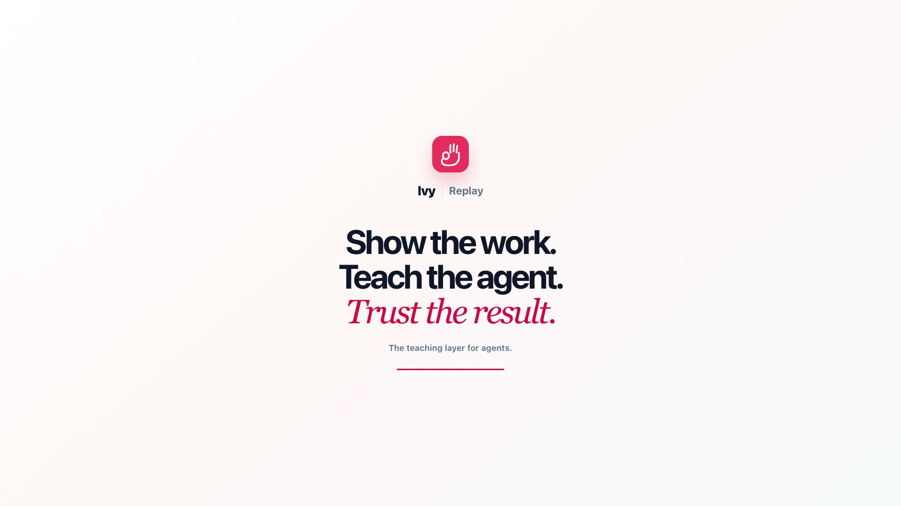

# Replay

Replay turns a demonstration of real work into a workflow that a person can inspect, correct, approve, export, and run again.

It is designed for the messy middle of agent building: the judgment between clicks that is obvious to an expert but missing from a process document. Replay records the work, links each proposed step back to evidence, surfaces uncertainty, and makes a reviewed workflow revision the source of truth.

> **Project status:** Replay is an early-stage macOS prototype. It can control real applications. Use test or supervised mode, review every generated workflow, and keep the emergency stop available. It is not yet a signed end-user release.

[](LICENSE)



[Watch the 74-second Replay product film](marketing/promo-video/output/replay-promo-1080p.mp4).

## What Replay does

1. **Capture:** record a task on the primary Mac display, with optional narration.
2. **Understand:** turn the evidence into steps, targets, checks, inputs, and decision branches.
3. **Review:** edit the draft and answer open questions. Unresolved low-confidence questions block approval.
4. **Approve:** create a content-hashed revision that cannot silently change underneath a run.
5. **Reuse:** export the approved workflow or run it in test, supervised, or revision-trusted autonomous mode.
6. **Prove:** keep run outcomes, decisions, action receipts, and screenshots as evidence.

Replay currently produces:

- a readable agent playbook in `SKILL.md`;
- a Playwright workflow and compile report;
- a portable computer-use bundle with its policy and safe target crops;
- guarded execution on the Mac, with a structured run log and evidence screenshots.

See the [architecture map](docs/architecture.md) for the end-to-end flow, concrete file outputs, process boundaries, and trust model. The implementation follows the [screen-to-workflow product design](docs/superpowers/specs/2026-08-16-screen-to-workflow-design.md).

## Development

Replay currently requires:

- macOS 14 or newer;
- Node.js 20.19 or newer in the Node 20 line, or Node.js 22.12 or newer, and npm;
- Swift 6;
- Screen Recording, Accessibility, and Input Monitoring permission for real capture;
- Microphone permission only when narration is enabled.

Install and verify the project:

```sh
npm install
npm run check
npm run build
npm run dev
```

Run the deterministic invoice demo separately with `npm run dev:test-app`.

`npm run check` builds the shared packages, type-checks every workspace, runs the offline test suites, executes both full Replay invoice branches in Chromium, runs a generated Playwright export, and runs the Swift sidecar suite. `npm run build` also produces the release capture sidecar and the production desktop and test-app assets.

## Model and privacy boundary

Copy `.env.example` to `.env` and set `ANTHROPIC_API_KEY`, or export it in the shell, before building or running a workflow. The development launcher loads the root `.env` automatically. `.env` files and Replay's local data directories are ignored by Git.

Replay does not upload the raw screen recording or raw audio. When the user starts **Build workflow**, the configured model can receive redacted condensed actions, narration text, selected full-screen frames, the frame plan, and workflow context. The selected frames are ordinary screenshots and are not visually redacted. During a run, fresh screenshots and task text can also be sent for verification, decisions, re-grounding, or a bounded action proposal. Secure-field event text is redacted before it is saved, and secure targets never receive reusable crop references.

Narration transcription is local and pluggable. Set `REPLAY_TRANSCRIBE_COMMAND` to an absolute executable that accepts `--input <audio.m4a> --output-json -` and returns the timestamped transcript shape in `packages/fixtures/recordings/invoice-match/transcript.json`. A pre-generated `transcript.json` beside a session is also accepted. Without either option, non-narrated recordings work normally and narrated recordings remain stored until a transcriber is configured.

For Apple Silicon development, `scripts/transcribe-whisper.mjs` is the included offline adapter. It defaults to Homebrew paths for `ffmpeg`, `whisper-cli`, and the whisper.cpp base model. `.env.example` documents overrides. The adapter suppresses tool output, uses owner-only files, and removes temporary transcription data after success, failure, or cancellation.

## Safety and local data

The emergency stop shortcut is **Command–Shift–Escape**. Moving the mouse during a run also pauses native actions. Test mode pauses before each step; supervised mode pauses at decision and handoff points; autonomous mode is unavailable until the exact approved revision completes a clean test run.

Replay stores captures, immutable workflow revisions, exports, and run logs below the app's local application-data directory. Secrets are represented by vault references rather than copied into workflow files. The normal UI never collects vault values, and the runner does not use or log them. Runtime answers are recorded, so they should not contain passwords or other secrets.

Every edit creates a new draft revision. Approval and clean-test trust apply only to the exact revision reviewed. A correction during a test run creates another draft and invalidates autonomous trust.

The automated suite cannot grant macOS privacy permissions. Before distributing a signed build, complete the [native clean-account checklist](native/capture/README.md) for real display, microphone, event-tap, Accessibility, emergency-stop, and interrupted-video behaviour.

## Contributing

Replay welcomes careful, evidence-backed contributions. Start with [CONTRIBUTING.md](CONTRIBUTING.md), follow the [Code of Conduct](CODE_OF_CONDUCT.md), and report security issues through the private process in [SECURITY.md](SECURITY.md).

## License

The repository's source and media are available under the [Apache License 2.0](LICENSE). The license does not grant permission to use Replay or Ivy trademarks except as needed to describe the project.
